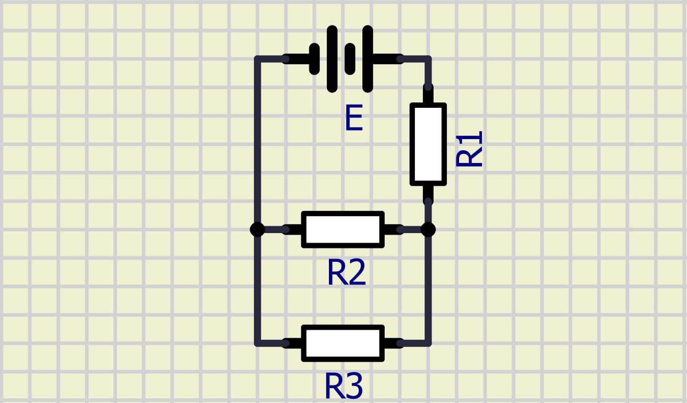
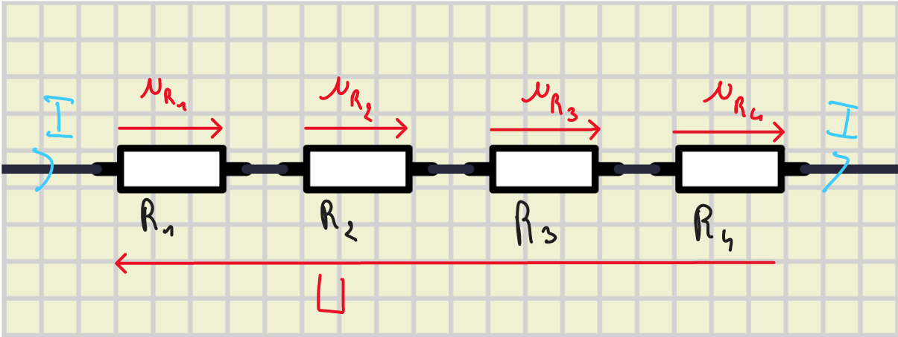
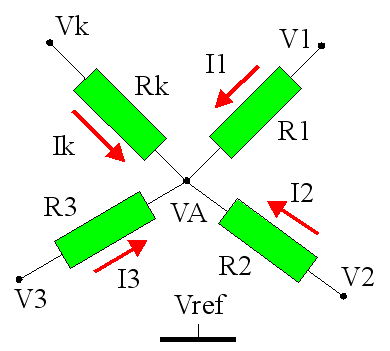

# Les lois

## Lois de base

> **Loi d'Ohm**
> 
> $U_R = R × I_R$ 
> 
> $u(t) = R × i_R(t)$ 

> **Loi Capacité**
> 
> $i_C(t) = C × \frac{\partial{u_C(t)}}{\partial{t}}$ 

> **Loi Inductance**
> 
> $u_L(t) = L × \frac{\partial{i_L(t)}}{\partial{t}}$ 

## Lois de Kirchhoff

> **Loi des noeud**
>
> Au noeud A, la somme des courants qui rentre est égale à la somme des courants qui sortent
> 
> $I_1 + I_2 + I_3 = I_4 + I_5$ 

### 1.2.2 : Loi des mailles

exemples de circuits : 

Maille 1 : $E,R_1,R_2$ 

Maille 2 : $R_2,R_3$ 

Maille 3 : $E,R_1,R_3$ 

> **Loi des mailles** 
>
> sur une maille : $\sum_{i}u_i=0$ 

Exemple : 

Maille 1 : $E-R_1I_1-R_2I_2=0$ 

Maille 2 : $R_2I_2-R_3I_3=0$ 

Maille 3 : $E-R_1I_1-R_3I_3=0$ 

## 1.3 : Association de résistances

### 1.3.1 : Résistance en série

-> résistance équivalente

$$

U_{R_I} = R_I × I
\\ \ \\
U = \sum_{i=1}^n u_{R_i} = \sum_{i=1}^n R_i × I
\\ \ \\
U =  I×\sum_{i=1}^n R_i = I×R_{eq}
\\ \ \\
R_{eq} = \sum_{i=1}^n R_i

$$

### 1.3.2 : Résitance en parallèlle

// schéma

$$

U_{R_i} = R_i × I_i = U

\\ \ \\

I = \sum_{i=1}^{n}I_i

\\ \ \\

I_i = \frac{U}{R_i}

\\ \ \\

I = \sum_{i=1}^{n}\frac{U}{R_i} = U × \sum_{i=1}^{n}\frac{1}{R_i}

\\ \ \\

\frac{1}{R_{eq}} = \sum_{i=1}^{n}\frac{1}{R_i}

$$

## Pont diviseur de tension

$$ 

U_k = R_k × I

\\ \ \\

U = \sum_{k=1}^{n}R_k

\\ \ \\

U_k = \frac { R_k × U }{ \sum_{k=1}^{n}R_k }
$$

## Pont diviseur de courant

$$ 

U = R_k × I_k

\\ \ \\

\frac{1}{R_{eq}} = \sum_{k=1}^{n}\frac{1}{R_k}

\\ \ \\

\frac{U}{R_{eq}} = I

\\ \ \\

R_k × I_k × \sum_{k=1}^{n}\frac{1}{R_k} = I

\\ \ \\

I_k = \frac{I}{R_k×\sum_{k=1}^{n}\frac{1}{R_k}}

$$

## Théorème de Millman

$$
U_1 = R_1I_1
\\ \ \\
U_2 = R_2I_2
\\ \ \\
U_3 = R_3I_3
\\ \ \\
U_4 = R_4I_4
\\ \ \\
U_5 = R_5I_5

\\ \ \\
\\ \ \\

R_kI_k = V_k-V_A
\\ \ \\
\sum_{k=1}^{N}I_k=0
\\ \ \\
\sum_{k=1}^{N}\frac{V_k-V_A}{R_k}=0
\\ \ \\
\sum_{k=1}^{N}\pembrace{\frac{V_k}{R_k}-\frac{V_A}{R_k}}=0
\\ \ \\
\sum_{k=1}^{N}\frac{V_k}{R_k}-\sum_{k=1}^{N}\frac{V_A}{R_k}=0
\\ \ \\
\sum_{k=1}^{N}\frac{V_k}{R_k}=V_A\sum_{k=1}^{N}\frac{1}{R_k}
\\ \ \\
V_A=\frac{ \sum_{k=1}^{N}\frac{V_k}{R_k} } {\sum_{k=1}^{N}\frac{1}{R_k}}

$$

## Générateur de thévenin équivalent

**Quel est le but ?**

Le but est de remplacé une partie du circuit par un Générateur et une résistance équivalente afin de simplifier le circuit.

> 
> Etape 1 : découper le circuit :
> on imagine qu'on retire les éléments dont on souhaite calculer le courant du circuit
>
> Etape 2 : éteindre les sources de tensions/courants (=fil) :
> grâce à cela on va pouvoir déterminer la résistance de thévenin 
>
> Etape 3 : rallumer les sources et déterminer la tension des deux pôles autour des éléments retirés
