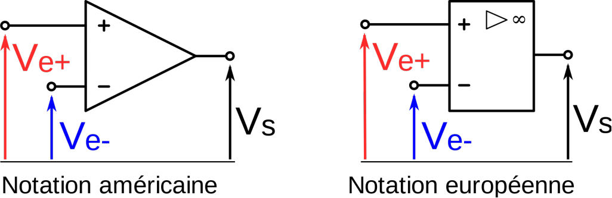
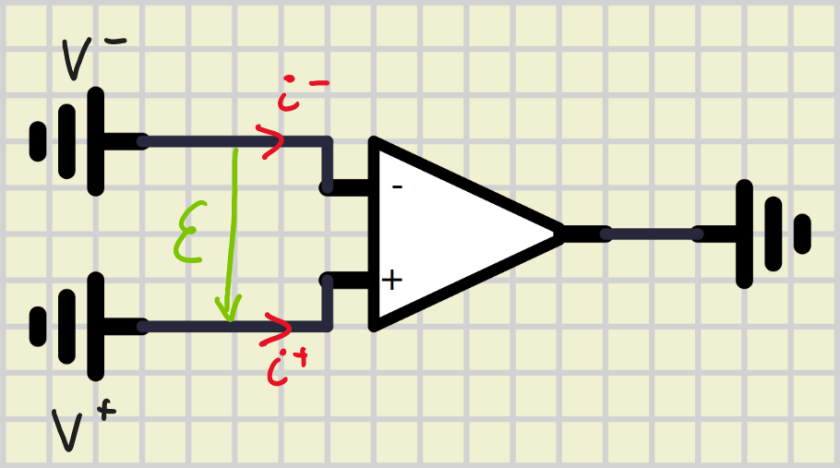

# Electronique Analogique

contact: franck.colombel@univ-rennes1.fr

2 séances TP 4h (logiciel PSpice)

Modalités d'évaluation:

- controle écrit
- 1 note de TP

___

## Chapitre I: Amplificateur opérationnel (AOP)

### 1 : Introduction

> _Définition_: Un amplificateur opérationnel est un amplificateur à grand gain réalisé à l'aide d'amplificateur différentiel.
> On a donc 2 entrées.  
> La tension de sortie $V_s$ est proportionelle à la différence entre 2 signaux d'entrée $V^+$ et $V^-$.  
> La tension $V^+$ est la tension d'entrée non inverseuse alors qur la tension $V^-$ est la tension inverseuse.  

Pour symboliser un AOP on a 2 possibilités :

Si on utilise un AOP en hautes fréquences, de nombreuses imperfections apparaissent:

- *Imperfections statiques* dues à la présence de générateurs de tension ou de courant.
- *Imperfections dynamiques* dues à la présence de condensateurs ou de bobines parasites.

### 2 : L'amplificateur opérationnel idéal

On peut écrire le signal de sortie de la manière suivante :  
$$
    V_s = A_{V_D}(V^+ - V^-) + A_{V_{MC}} \embrace{\frac{V^+ + V^-}{2}}{(}{)} \\\ \\
\begin{split}
    A_{V_D}&:\text{correspond au gain différentiel}\\
    A_{V_{MC}}&:\text{correspond au gain de Mode Commun}
\end{split}
$$

- Dans le cas de l'AOP idéal, $A_{V_D} \rightarrow \inf$ et $A_{V_{MC}} \rightarrow 0$, soit $\epsilon = V^+ - V^- = 0\text{V}\Rightarrow V^+ = V^-$  
- $i^+ = 0\text{A},\ i^- = 0\text{A}$ donc les impédences d'entrées sont infinies.  

### 3 : Les 3 régimes de fonctionnement

Les 3 régimes de fonctionnement sont définis en fonction de la nature de rebouclage de la sortie sur l'entrée **et** de la nature des composants dans la _chaîne de rétroaction_ *(le rebouclage)*.

#### 1) Le régime linéaire

Le régime linéaire se caractérise par:

- un rebouclage de la sortie sur l'entrée $\ominus$ .
- le bloc de contre réaction ne contient que des composants linéaires.
- $V_s$ est une fonction linéaire des signaux d'entrée.

_Exemple :_

Supposons que l'AOP est idéal :  
Calculons $V_s = f(V_e)$  

$$
    \embrace{
        V_e &= R_1 I\\
        V_s &= -R_2 I
    }{.}{)} \text{Loi d'Ohm} \\

    \text{Fonction d'amplification}:\ \boxed{\frac{V_s}{V_e} = \frac{-R_2}{R_1}}
$$

Calculons $V_s = f(V_e)$ *en faisant tendre $A_{V_D}$ vers l'infini*

$$
    \embrace{
        V_e &= R_1 I - \epsilon \\
        V_s &= A_{V_D} \epsilon \\
        \epsilon &= -R_2I-V_s
    }{\{}{.}
$$

$$
    \embrace{
        V_e &= R_1 I - \frac{V_s}{A_{V_D}} \\
        \frac{V_s}{A_{V_D}}+V_s &= -R_2I
    }{\{}{.}
$$

$$
    \embrace{
        V_e &= R_1I-\frac{V_s}{A_{V_D}} \\
        I &= -\frac{V_s}{R_2} \embrace{1+\frac{1}{A_{V_D}}}{(}{)}
    }{\{}{.}\\\ \\

\begin{split}
    V_e &= -\frac{R_1}{R_2}V_s \embrace{1+\frac{1}{A_{V_D}}}{(}{)} - \frac{V_s}{A_{V_D}} \\\ \\
    V_e &=  V_s \embrace{-\frac{R_1}{R_2} -\frac{R_1}{R_2 A_{V_D}} -\frac{1}{A_{V_D}}}{[}{]} \\\ \\
    A_{V_D} &\rightarrow \infin \Rightarrow V_E = -\frac{R_1}{R_2} V_s \iff  \boxed{\frac{V_s}{V_e} = \frac{-R_2}{R_1}}
\end{split}
$$

#### 2) régime linéaire - non linéaire

Le régime linéaire - non linéaire se caractérise par :

- un rebouclage de la sortie sur l'entrée $\ominus$ .
- le bloc de contre réaction contient des éléménts non linéaires *(diodes, transistors, ...)*

#### 3) régime non linéaire

Le régime non linéaire se caractérise par :

- un rebouclage de la sortie sur l'entrée $\oplus$ .
- l'AOP peut fonctionner en boucle ouverte (sous rebouclage).
- il n'existe pas d'expression littérale liant $V_s$ et $V_e$ .
- $V_s$ prend deux valeurs déterministes $\plusmn V_{sat}$ . *($V_{sat}$ est très proche de la tension d'alimentation continue de l'AOP)* .

<u>Exemple :</u> Le comparateur inverseur

L'étude du comparateur reviens à étudier le signe de $\epsilon = V^+ - V^-$ .

- Si $\epsilon > 0 \Rightarrow V_s = +V_{sat}$
- Si $\epsilon < 0 \Rightarrow V_s = -V_{sat}$

Supposons un état initial $V_s = +V_{sat}$ , $(V^+ > V^-)$ :

- $V^+ = \frac{R_1}{R_1+R_2} V_{sat}$

Tant que $V_e$ ( $=V^-$ ) est inférieur à $V^+(\frac{R_1}{R_1+R_2}V_{sat})$ la sortie du comparateur reste à $+ V_{sat}$  
Dès que $V_e$ ( $=V^-$ ) devient supérieure à $V^+ (\frac{R_1}{R_1+R_2}V_{sat})$ la sortie du comparateur bascule et passe à $- V_{sat}$

- $V^+$ s'écrit alors $V^+ = -\frac{R_1}{R_2+R_2}V_{sat}$  

Tant que $V_e$ est supérieure à $V^+(-\frac{R_1}{R_1+R_2}V_{sat})$, $V_s$ reste à $-V_{sat}$  
Dès que $V_e$ devient inférieur à $V^+(-\frac{R_1}{R_1+R_2}V_{sat})$, la sortie du comparateur bascule et $V_s$ passe à nouveau à $+ V_{sat}$

